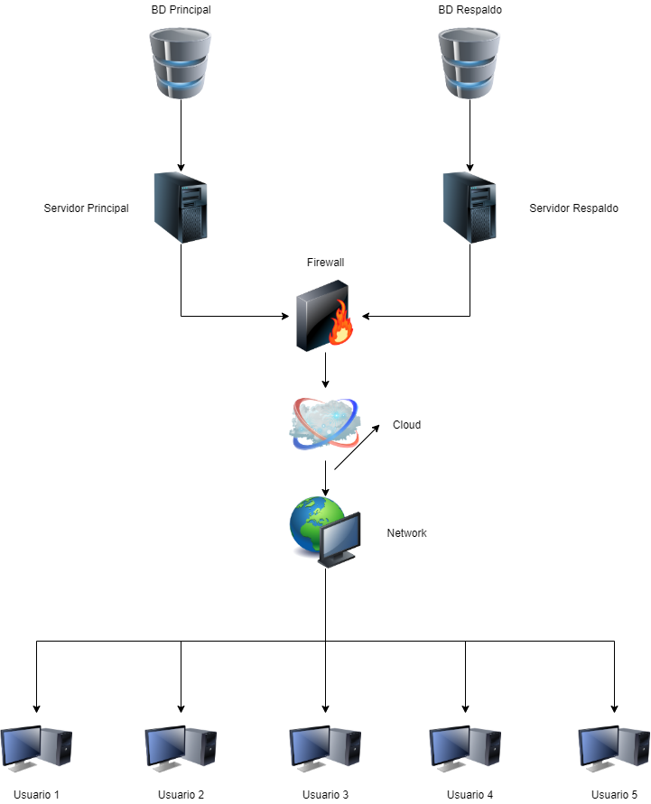

# Tipo de Sistema de información

## :trophy: C0.2 Reto en clase

Investigación sobre el tipo de sistema que involucra el caso de estudio a desarrollar

___

## Instrucciones

- Realizar una investigación sobre el tipo de sistema que se habrá de desarrollar, respondiendo a las preguntas que se plantean en la sesión de desarrollo.
- Puede apoyarse de la herramienta Draw.io para elaborar los diagramas o ilustraciones que se solicitan o considere necesario.
- Toda actividad o reto se deberá realizar utilizando el estilo **MarkDown con extension .md** y el entorno de desarrollo VSCode, debiendo ser elaborado como un documento **single page**, es decir si el documento cuanta con imágenes, enlaces o cualquier documento externo debe ser accedido desde etiquetas y enlaces.
- Es requisito que el archivo .md contenga una etiqueta del enlace al repositorio de su documento en Github, por ejemplo **Enlace a mi GitHub**
- Al concluir el reto el reto se deberá subir a github el archivo .md creado.
- Desde el archivo **.md** se debe exportar un archivo **.pdf** con la nomenclatura **C0.2_NombredelaActividad_NombreAlumno.pdf**, el cual deberá subirse a classroom dentro de su apartado correspondiente, para que sirva como evidencia de su entrega; siendo esta plataforma **oficial** aquí se recibirá la calificación de su actividad por individual.
- Considerando que el archivo .pdf, fue obtenido desde archivo .md, ambos deben ser idénticos y mostrar el mismo contenido.
- Su repositorio ademas de que debe contar con un archivo **readme**.md dentro de su directorio raíz, con la información como datos del estudiante, equipo de trabajo, materia, carrera, datos del asesor, e incluso logotipo o imágenes, debe tener un apartado de contenidos o indice, los cuales realmente son ligas o **enlaces a sus documentos .md**, _evite utilizar texto_ para indicar enlaces internos o externo.
- Se propone una estructura tal como esta indicada abajo, sin embargo puede utilizarse cualquier otra que le apoye para organizar su repositorio.

```
| readme.md
| | blog
| | | Cx.1_NombredelaActividad.md
| | | Ax.1_NombredelaActividad.md
| | diagrams
| | docs
| | html
| | img
| | pdf    
```
___

## :pencil2:  Desarrollo

1. Apoyado de la información mostrada por el asesor, realice una investigación, donde se pueda dar respuesta a los siguientes puntos:

  - Identifique a que tipo de sistema esta referido el caso de estudio y porque cae en esta categoría.  
  - Describa las características que debe tener el caso de estudio para cumplir con el tipo de sistema.
  - Una vez que se cuenta con los conceptos de los puntos anteriores, elabore una ilustración que explique el flujo de interacción del sistema y sus componentes que lo habrán de integrar (vistas gráficas, controladores, Base de datos,..) para el caso de estudio.
  - Explique en clase su investigación.
___

### :bomb: Rubrica

| Criterios     | Descripción                                                                                  | Puntaje |
| ------------- | -------------------------------------------------------------------------------------------- | ------- |
| Instrucciones | Se cumple con cada uno de los puntos indicados dentro del apartado Instrucciones?            | 20 |
| Desarrollo    | Se respondió a cada uno de los puntos solicitados dentro del desarrollo de la actividad?     | 80      |

___
___

## Caso de estudio 1: Cursos y certificaciones

“The vid of knowledge” es una empresa ofrece herramientas tecnologías basadas en la administración y conservación del conocimiento, sin embargo debido a la gran competitividad del mercado y a las condiciones actuales y cambiantes, esta considerando proveer una aplicación referente a “cursos y certificaciones” por medio de una plataforma en línea, a un nivel de calidad y costo que le permita obtener mayores ganancias. A través de un estudio de mercado sobre otras plataformas similares, se observa que entre las características que se debe ofrecer dentro de este modelo de negocio están los siguientes:

1. Ofrecer a los usuarios una plataforma que este disponible en todo momento, que sea fácil de utilizar y atractiva, así como garantice seguridad de la información que ahí se registre.

2. Ofrecer a los usuarios inscribirse a un cualquier curso a través de un catalogo, y/o un mapa de ruta de cursos basado en un perfil establecido.

3. Permitir que los cursos que se publiquen y ofrezcan puedan ser creados utilizando distintos formatos tales como son videos o presentaciones, y separadas por tópicos con un limite máximo de tamaño y duración.

4. Ofrecer al usuario los avances logrados por cada curso, y al ser completado a través de una evaluación exitosa, otorgue un comprobando de certificación.

5. Ofrecer analítica de datos sobre los cursos que son mas solicitados, los cursos a los cuales los usuarios se enrolaron y completaron, así como los usuarios a los cuales su certificación esta por expirar o expiro.
___

## Tipo de sistema

### **Sistema de administración del conocimiento (KMS Knowledge Managment System)**

Un sistema de gestión del conocimiento es una herramienta que usan las empresas para organizar la documentación, las preguntas frecuentes y otros tipos de información en formatos de fácil acceso para clientes internos y externos.

Usar un software de gestión del conocimiento puede ayudarle a mantener actualizada su documentación, así como también ayudar a los clientes a encontrar sus propias respuestas y a administrar el acceso al conocimiento y los permisos en todos los grupos de usuarios. Es una herramienta valiosa tanto para pequeñas empresas que recién comienzan como para grandes empresas de proyección internacional que necesitan distribuir el conocimiento a una amplia variedad de audiencias.

Este caso de estudio se identifica a este tipo de sistema ya que te permite tanto guardar información de los cursos que se quieren implementar como mostrar cierta información a los usuarios (información de los usuarios y de los cursos).

### **Características**
- Capacitación de Recursos Humanos (para los dicentes y una posible guía rápida para el usuario)
- Reducción de tiempos y costo del aprendizaje (ya que se puede reutilizar el material)
- Retención de la propiedad intelectual
- Reutilización y Realimentación del Capital Intelectual
- Retención de las Buenas practicas
- Alarmas de notificación de Tareas (principalmente para los usuarios)

### **Ilustración**

<p align="center">
    
</p>

___
___

:house: [Ir a inicio](../README.md)

:file_folder: [Link a Github](https://github.com/GustavoValadez/Analisis-Avanzado-Software)
