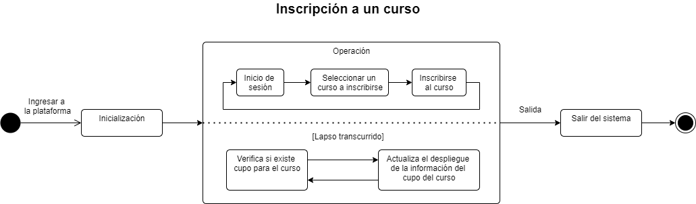
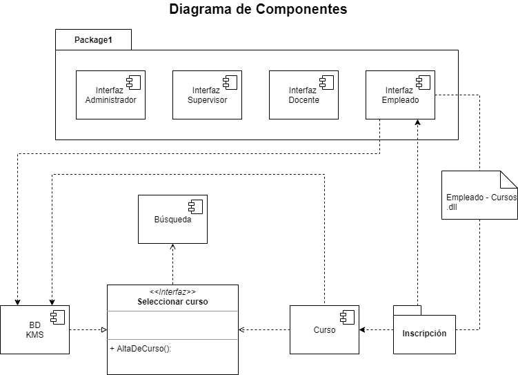
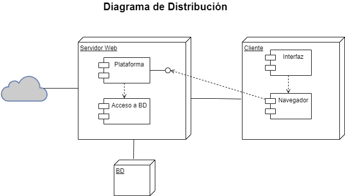

# Introducción

## :trophy: C1.5 Reto en clase

Modelado de requisitos a través de diagramas de comportamiento

### :blue_book: Instrucciones

- Basado en una investigación y en el documento proporcionado por el asesor, realice para el caso de
estudio, un ejemplo de los diagramas indicados en el apartado desarrollo.
- El diagrama a ilustrar podrá ser realizado con la herramienta UML llamada draw.io, la cual deberán estar
integradas a visual studio code.
- Toda actividad o reto se deberá realizar utilizando el estilo **MarkDown con extension .md** y el entorno de desarrollo VSCode, debiendo ser elaborado como un documento **single page**, es decir si el documento cuanta con imágenes, enlaces o cualquier documento externo debe ser accedido desde etiquetas y enlaces, y debe ser nombrado con la nomenclatura
**C1.5_NombredelaActividad_NombreAlumno.pdf**.
- Es requisito que el archivo .md contenga una etiqueta del enlace al repositorio de su documento en Github, por ejemplo **Enlace a mi GitHub** y al concluir el reto se deberá subir a github.
- Desde el archivo **.md** exporte un archivo **.pdf** que deberá subirse a classroom dentro de su apartado
correspondiente, sirviendo como evidencia de su entrega, ya que siendo la plataforma **oficial** aquí se
recibirá la calificación de su actividad.
- Considerando que el archivo .pdf, fue obtenido desde archivo .md, ambos deben ser idénticos y mostrar el mismo contenido.
- Su repositorio ademas de que debe contar con un archivo **readme**.md dentro de su directorio raíz, con la información como datos del estudiante, equipo de trabajo, materia, carrera, datos del asesor, e incluso logotipo o imágenes, debe tener un apartado de contenidos o indice, los cuales realmente son ligas o **enlaces a sus documentos .md**, _evite utilizar texto_ para indicar enlaces internos o externo.
- Se propone una estructura tal como esta indicada abajo, sin embargo puede utilizarse cualquier otra que le apoye para organizar su repositorio.

```
| readme.md
| | blog
| | | Cx.1_NombredelaActividad.md
| | | Ax.1_NombredelaActividad.md
| | diagrams
| | docs
| | html
| | img
| | pdf    
```

___

## :pencil2: Desarrollo
### Caso de estudio 1: Cursos y certificaciones. 

1. Instale dentro de visual studio code Draw.io.
 
2. Elabore los siguientes diagramas:
+ **Diagrama de estados**
+ **Diagrama de componentes**
+ **Diagrama de distribución**
   
___

- Diagrama de casos de uso

<p align="center">
    
</p>

- Diagrama de secuencia 

<p align="center">
    
</p>

- Diagrama de clases

<p align="center">
    
</p>
    

___

### :bomb: Rúbrica

| Criterios     | Descripción                                                                                  | Puntaje |
| ------------- | -------------------------------------------------------------------------------------------- | ------- |
| Instrucciones | Se cumple con cada uno de los puntos indicados dentro del apartado Instrucciones?            | 20 |
| Desarrollo    | Se respondió a cada uno de los puntos solicitados dentro del desarrollo de la actividad?     | 80      |

---

:file_folder: [Link a Github](https://github.com/GustavoValadez/Analisis-Avanzado-Software)


